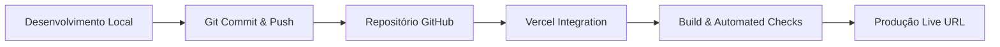

# 🏗️ Arquitetura e Decisões Técnicas

Este documento descreve a arquitetura de software, convenções de código e fluxo de deploy adotados no projeto do Portfólio.

---

## 🎯 Objetivos de Design

1. **Performance e Carregamento Rápido**: Utilização do Next.js App Router para Server-Side Rendering (SSR) e Static Site Generation (SSG).
2. **SEO Otimizado**: Meta tags configuradas dinamicamente com suporte a Open Graph para redes sociais.
3. **Acessibilidade & Usabilidade**: Elementos semânticos HTML5 (`<header>`, `<main>`, `<section>`, `<footer>`), suporte a navegação por teclado e contraste acessível.
4. **Escalabilidade e Modularidade**: Separação clara de responsabilidades em componentes React independentes.

---

## 🎨 Sistema de Design e Cores

O projeto utiliza **Tailwind CSS** combinado com classes utilitárias personalizadas em `src/app/globals.css`.

### Paleta de Cores
- **Primária (Accent)**: Azul Violeta Índigo (`#6366f1` / `#4f46e5`)
- **Secundária**: Rosa Choque Néon / Violeta Ciano (`#ec4899` / `#a855f7`)
- **Modo Escuro**: Fundo Slate Noturno (`#0f172a` / `#020617`), Texto Claro (`#f8fafc`)
- **Modo Claro**: Fundo Off-White (`#f8fafc`), Texto Escuro (`#0f172a`)

---

## 💻 Estrutura de Componentes

### `Header.tsx`
- Barra de navegação fixa com efeito *glassmorphism* (`backdrop-blur-md`).
- Links para navegação suave suave (smooth scrolling) entre seções.
- Botão interativo para chavear entre o Modo Escuro e Claro.

### `Hero.tsx`
- Apresentação inicial marcante com gradiente dinâmico no texto de título.
- Chamadas para ação (CTA): "Ver Projetos" e "Entre em Contato".
- Badges com tecnologias principais.

### `About.tsx`
- Resumo sobre trajetória profissional, valores de desenvolvimento e métricas (anos de experiência, projetos concluídos, etc.).

### `Projects.tsx`
- Cards de projetos com animações ao passar o mouse (*hover scaling*), tags de tecnologia e botões de acesso direto ao repositório no GitHub e ao demo online na Vercel.

### `Skills.tsx`
- Classificação organizada de habilidades por categorias com indicadores de proficiência e ícones visuais.

### `Contact.tsx`
- Formulário de mensagens interativo e opções de contato rápido via E-mail, GitHub e LinkedIn.

---

## 🚀 Fluxo de Publicação e CI/CD

1. **GitHub**: Armazena o código-fonte, histórico de commits e gerencia o controle de versão.
2. **Vercel**: Detecta atualizações automaticamente via webhook do GitHub, compila os arquivos do Next.js e disponibiliza em servidores Edge globais.
